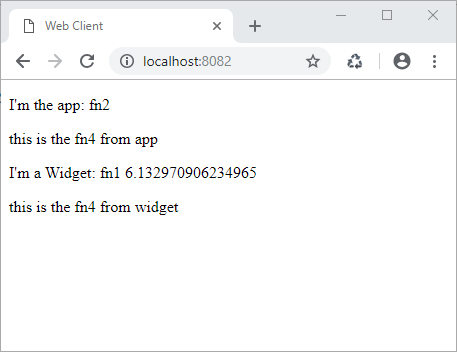
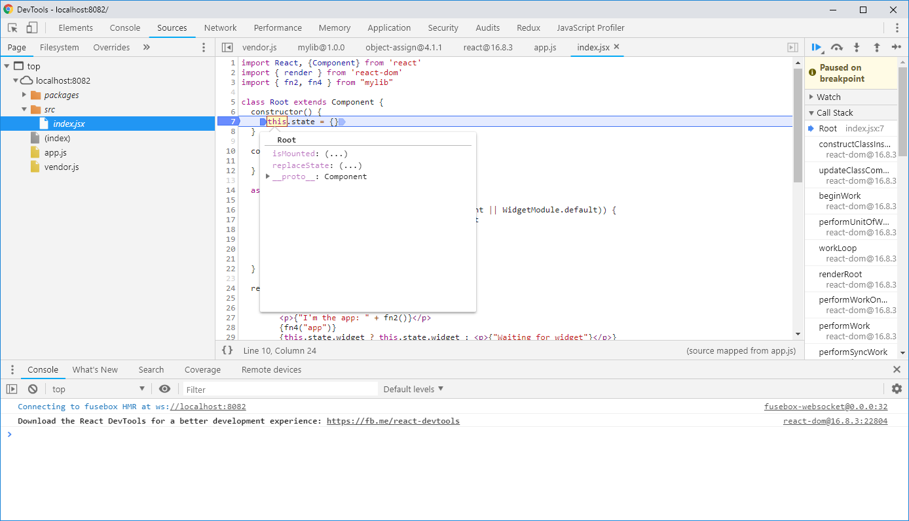
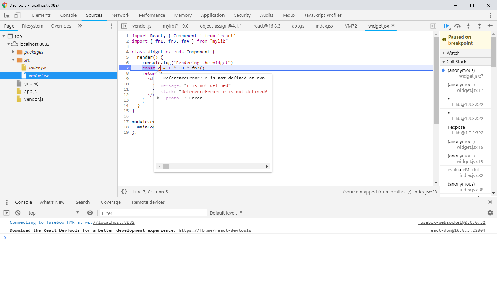
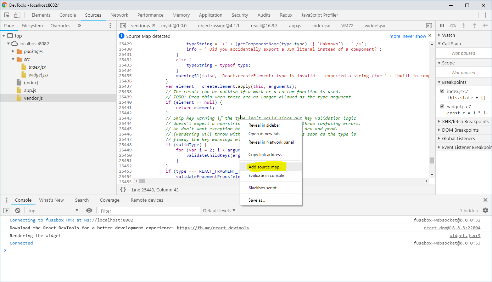

# Source maps issues with FuseBox

This repository contains an example of some issues concerning *npm packages* and *dynamic loaded bundles* built with FuseBox.

## Scenario

The production scenario consists of a React application `app`, an *npm* package `lib` and a bundle `widget`.

The `lib` and the `widget` are built independently each other. They have independent projects and independent builds.

The `app` is built with `lib` as an *npm* dependency.

The `widget` is dynamically loaded with dynamic `import()`.

The project in this repository is a simplification of the production scenario, just for analysis. It consists of a main application (`src/app`), an *npm* package (`src/lib`) and a dynamic loaded module (`src/widget`).

## Reproducing the issues

Clone this repository on your machine, install dependencies and run `npm start`.

Open your browser to http://localhost:8082/

You should see the following result:

### Working case

Now open the browser's development tools (I use *Chrome Dev tools*), select `src/index.jsx` as source file and put a breakpoint on the single line in the `constructor()` function and reload the Web page.

The breakpoint works fine and the debug data for variables are available, as shown by the following picture:

### Source maps misalignment

Now, from the Dev tools select `src/widget.jsx` and put a breakpoint on row number 7 (or any other row). Reload the Web page and you see the following situation:

In this case, the breakpoint works fine, but the debug data are not correct (see the error message *Reference error: r is not defined*)

### Source maps not loaded

Even though the source maps of the library's bundle has been generated, I'm not able to see the sources in the Dev tools. They are ignored even if I load them manually via *Add source map...*, as shown by the following picture:

